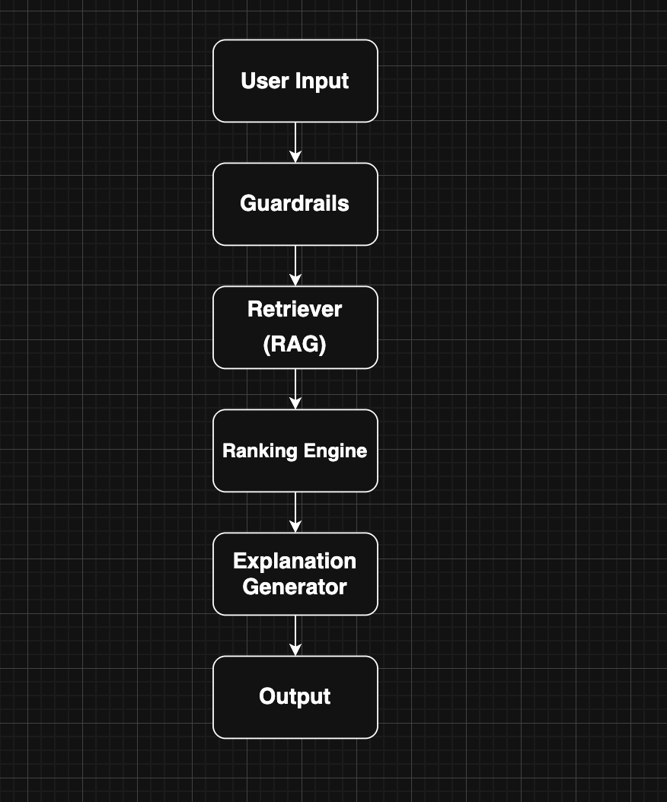
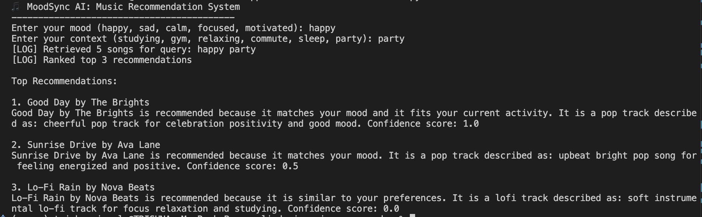

# 🎵 MoodSync AI: Music Recommendation System

## Overview
MoodSync AI is an applied AI system that recommends music based on a user's mood and context (e.g., studying, gym, relaxing). It uses a retrieval-based approach combined with ranking and explanation to generate meaningful recommendations.

---

## Original Project
This project extends the Module 3 Music Recommender Simulation by adding:
- Retrieval-Augmented Generation (RAG)
- Scoring and ranking system
- Explanation generation
- Guardrails for input validation
- Reliability testing using pytest

---

## Features
- 🎯 Mood + context-based recommendations
- 🔍 Retrieval system (RAG-style filtering)
- 📊 Ranking with confidence scores
- 🧠 AI-style explanations
- 🛡️ Input validation (guardrails)
- ✅ Automated tests for reliability

---

## System Architecture


## Demo


---

## Setup

```bash
python3 -m venv .venv
source .venv/bin/activate
pip install -r requirements.txt
python -m src.main
